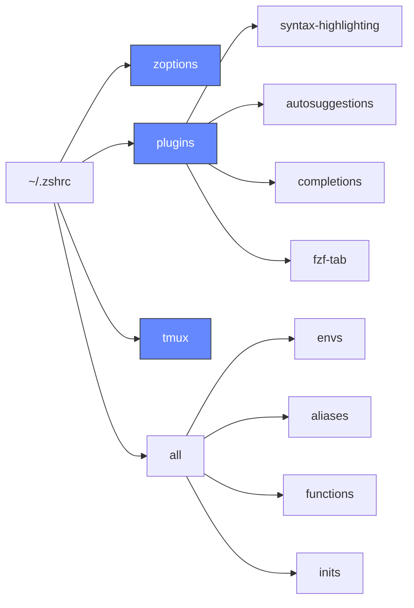

Legendary shell configuration for Zsh. Works on **macOS** and **Linux** (Arch, Ubuntu/Debian, Fedora). Originally based on [omarchy-zsh](https://github.com/omacom-io/omarchy-zsh) by [Ryan Hughes](https://github.com/ryanhughes).

## Features

### Tmux dev layouts from Omarchy

The tmux functions from [Omarchy](https://github.com/basecamp/omarchy) are incredibly useful for terminal-based development. I've brought `tdl`, `tdlm`, and `tsl` into legendary-zsh so you get one-command dev layouts — an editor pane, AI assistant pane, and terminal — without any manual window management.

### Quality of life

Out of the box, zsh is missing a lot. legendary-zsh fixes that:

- **Syntax highlighting as you type** — commands light up green when valid, red when not, before you hit enter
- **Autosuggestions from history** — faint inline completions pulled from your command history, accept with the right arrow key
- **Fuzzy search everything** — files, git log, command history, directories, and shell variables all searchable via fzf keybindings
- **Tab completion that actually works** — case-insensitive, fzf-powered, with file previews and color
- **Smart directory navigation** — `z` learns your most-used directories so you can jump to them by partial name
- **Modern `ls`** — `eza` replaces `ls` with color, icons, and git status built in
- **Cross-platform** — one install command works on macOS, Arch, Ubuntu/Debian, and Fedora

## Install

```bash
curl -fsSL https://raw.githubusercontent.com/jzetterman/legendary-zsh/master/install.sh | bash
```

The installer automatically detects your OS and installs all dependencies:

| | Package Manager | Packages |
|---|---|---|
| **macOS** | Homebrew | git, zsh, fzf, starship, zoxide, eza, gum |
| **Arch** | pacman | git, zsh, fzf, starship, zoxide, eza, gum |
| **Ubuntu/Debian** | apt + official installers | git, zsh, fzf, starship, zoxide, eza, gum |
| **Fedora** | dnf + official installers | git, zsh, fzf, starship, zoxide, eza, gum |

During installation you'll be prompted to optionally install [fastfetch](https://github.com/fastfetch-cli/fastfetch) to show system info when new terminal sessions start.

Restart your terminal to activate zsh.

### Non-interactive install

For automated provisioning (Ansible, cloud-init, CI), set `LEGENDARY_NONINTERACTIVE=1`. Every prompt skips with a preservation-safe default — your shell, existing starship config, and `~/.inputrc` are left alone. Opt in to specific prompts with the overrides below:

| Env var | Default | Effect when `yes` |
|---|---|---|
| `LEGENDARY_CHSH` | no | Change the default login shell to zsh |
| `LEGENDARY_STARSHIP_REPLACE` | no | Replace an existing `~/.config/starship.toml` (backing it up first) |
| `LEGENDARY_FASTFETCH` | no | Install fastfetch and enable it on new shells |
| `LEGENDARY_UNINSTALL_CONFIRM` | no | Confirm `legendary-uninstall` (destructive — default is to abort) |

Example:

```bash
LEGENDARY_NONINTERACTIVE=1 LEGENDARY_CHSH=yes LEGENDARY_FASTFETCH=yes \
  bash -c "$(curl -fsSL https://raw.githubusercontent.com/jzetterman/legendary-zsh/master/install.sh)"
```

## Update

After installation, `legendary-update` is available on your PATH. Run it any time to get the latest changes:

```bash
legendary-update
```

This will:
- Pull the latest changes from the repository
- Run any pending migrations (e.g. config fixes for new OS support)
- Install any newly added dependencies

## Toggle fastfetch

Turn it off:

```bash
legendary-disable-fastfetch
```

Turn it back on (installs fastfetch first if it's not on your system):

```bash
legendary-enable-fastfetch
```

## Architecture



## fzf Keybindings

- **Ctrl+Alt+F** - Search files/directories
- **Ctrl+Alt+L** - Search Git Log
- **Ctrl+R** - Search command history
- **Ctrl+T** - Search files in current directory
- **Ctrl+V** - Search Variables
- **Alt+C** - cd into selected directory

## Tmux Functions

Ported from [Omarchy](https://github.com/basecamp/omarchy):

- **`tdl <ai> [<ai2>]`** - Dev layout: editor (70%), AI pane (30%), terminal (15% bottom)
- **`tdlm <ai> [<ai2>]`** - Multi-project: one `tdl` window per subdirectory
- **`tsl <count> <cmd>`** - Swarm layout: tiled panes all running the same command
- **`t`** - Attach to existing tmux session or create a new one

## Customization

Add your own configuration at the bottom of `~/.zshrc` after the legendary-zsh loading.

### Using legendary-zsh in bash

legendary-zsh targets zsh and does not manage `~/.bashrc`. If you'd like the aliases, functions, and tool integrations available when you fall back to bash, add this line to your `~/.bashrc`:

```bash
source ~/.local/share/legendary-zsh/shell/all
```

### Adding directories to PATH

Two ways to add a directory to your `PATH` that survive new shells, reboots, and `legendary-update`:

**Interactively** — use the helper:

```bash
legendary-path-add ~/.config/hypr/scripts
```

**Manually** — edit `~/.config/legendary-zsh/paths` (one directory per line, `#` comments allowed):

```
# Hyprland helper scripts
$HOME/.config/hypr/scripts
```

Both write to the same file. Entries support `$HOME` and `~/`, duplicates are skipped, and directories that don't exist at shell startup are silently ignored. Open a new shell (or `source ~/.zshrc`) to pick up changes.

## Uninstall

```bash
rm -rf ~/.local/share/legendary-zsh
```

Restore your shell config from backups (saved as `~/.zshrc.backup-*` and `~/.bashrc.backup-*`).

## Credits

Originally created by [Ryan Hughes](https://github.com/ryanhughes) as [omarchy-zsh](https://github.com/omacom-io/omarchy-zsh). Licensed under MIT.
