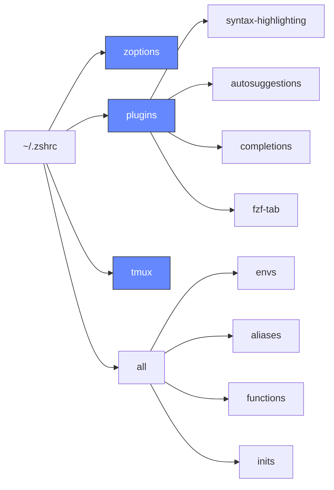

Legendary shell configuration for Zsh. Based on [omarchy-zsh](https://github.com/omacom-io/omarchy-zsh) by [Ryan Hughes](https://github.com/ryanhughes).

## What's different from omarchy-zsh?

- **Distro-agnostic** — no pacman, no `/usr/share/`. Clone it anywhere, works on Arch, Fedora, Ubuntu, macOS, etc.
- **Zsh plugins via git clone** — syntax highlighting, autosuggestions, completions, and fzf-tab with no plugin manager or system packages required
- **Enhanced tmux functions** — `tdl`, `tdlm`, and `tsl` from [Omarchy](https://github.com/omacom-io/omarchy) for dev layouts and swarm panes
- **Tab completion that works** — `compinit` enabled with case-insensitive matching and fzf-tab integration

## Install

```bash
curl -fsSL https://raw.githubusercontent.com/jzetterman/legendary-zsh/master/install.sh | bash
```

The installer automatically detects your OS and installs all dependencies:

| | Package Manager | Packages |
|---|---|---|
| **macOS** | Homebrew | git, zsh, fzf, starship, zoxide, eza, gum |
| **Arch** | pacman | git, zsh, fzf, starship, zoxide, eza, gum |
| **Ubuntu/Debian** | apt + official installers | git, zsh, fzf, starship, zoxide, eza, gum |
| **Fedora** | dnf + official installers | git, zsh, fzf, starship, zoxide, eza, gum |

During installation you'll be prompted to optionally install [fastfetch](https://github.com/fastfetch-cli/fastfetch) to show system info when new terminal sessions start.

Restart your terminal to activate zsh.

## Update

```bash
legendary-update
```

This pulls the latest changes, installs any new dependencies, and runs pending migrations.

## Architecture



## fzf Keybindings

- **Ctrl+Alt+F** - Search files/directories
- **Ctrl+Alt+L** - Search Git Log
- **Ctrl+R** - Search command history
- **Ctrl+T** - Search files in current directory
- **Ctrl+V** - Search Variables
- **Alt+C** - cd into selected directory

## Tmux Functions

- **`tdl <ai> [<ai2>]`** - Dev layout: editor (70%), AI pane (30%), terminal (15% bottom)
- **`tdlm <ai> [<ai2>]`** - Multi-project: one `tdl` window per subdirectory
- **`tsl <count> <cmd>`** - Swarm layout: tiled panes all running the same command
- **`t`** - Attach to existing tmux session or create a new one

## Customization

Add your own configuration at the bottom of `~/.zshrc` after the legendary-zsh loading.

## Uninstall

```bash
rm -rf ~/.local/share/legendary-zsh
```

Restore your shell config from backups (saved as `~/.zshrc.backup-*` and `~/.bashrc.backup-*`).

## Credits

Originally created by [Ryan Hughes](https://github.com/ryanhughes) as [omarchy-zsh](https://github.com/omacom-io/omarchy-zsh). Licensed under MIT.
